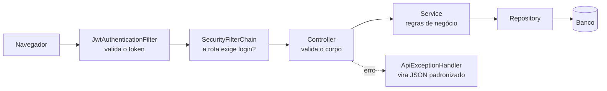
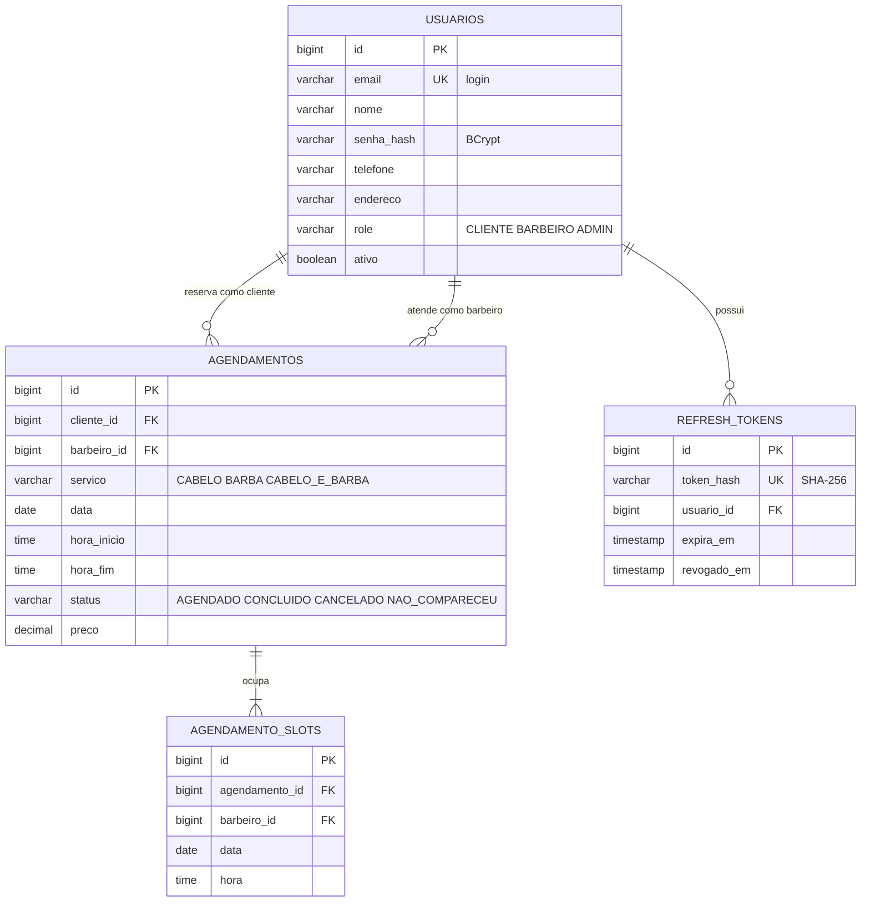
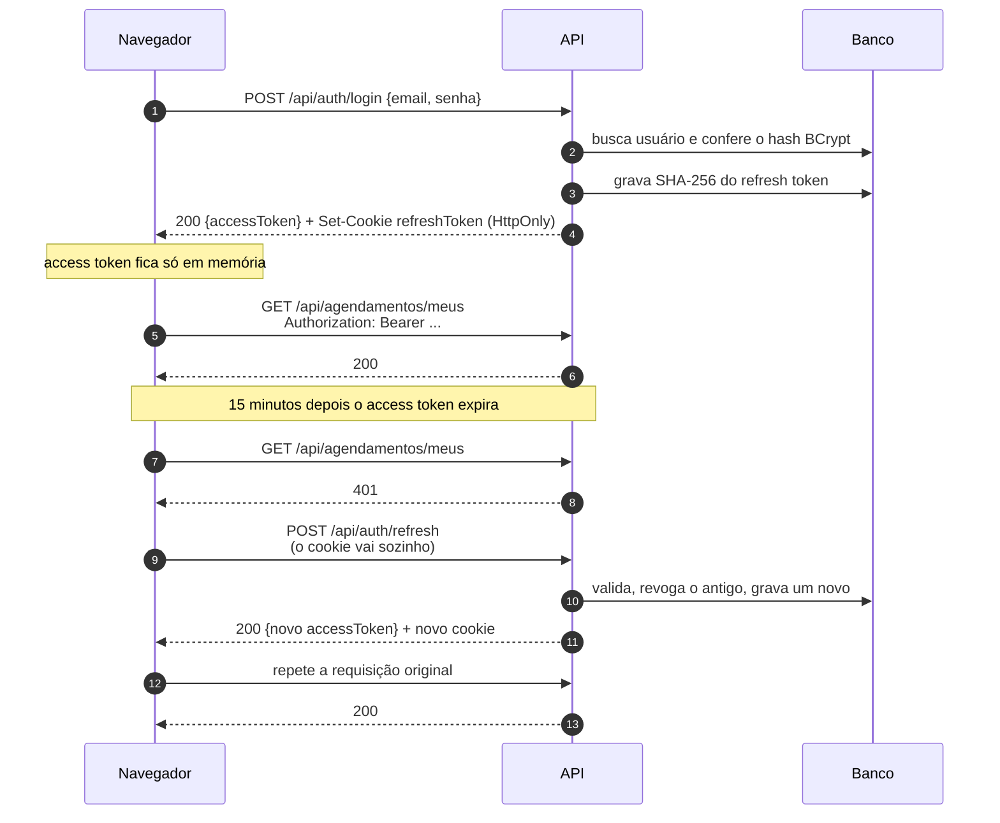
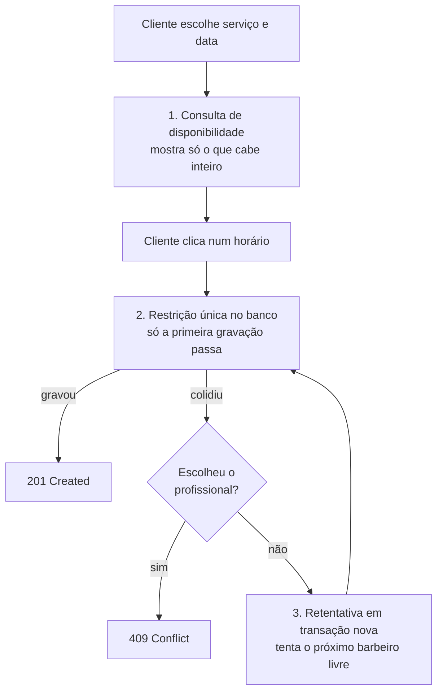

# Barbearia Conde


Site e API de uma barbearia real, em Bady Bassitt (SP). O cliente cria conta, vê os
horários que estão **de fato** livres e reserva o atendimento. Dois clientes não
conseguem ocupar o mesmo horário do mesmo profissional — nem que apertem o botão no
mesmo instante.

**Stack:** Java 21 · Spring Boot 3.5 · Spring Security + JWT · Spring Data JPA ·
H2 / MySQL · JUnit 5 · OpenAPI · front em HTML, CSS e JavaScript sem framework.

---

## Índice

1. [O que este projeto resolve](#1-o-que-este-projeto-resolve)
2. [Começando](#2-começando)
3. [Como a aplicação está organizada](#3-como-a-aplicação-está-organizada)
4. [Autenticação explicada](#4-autenticação-explicada)
5. [A agenda explicada](#5-a-agenda-explicada)
6. [Usando a API na prática](#6-usando-a-api-na-prática)
7. [Front-end](#7-front-end)
8. [Testes](#8-testes)
9. [Configuração de referência](#9-configuração-de-referência)
10. [Antes de publicar: checklist de segurança](#10-antes-de-publicar-checklist-de-segurança)
11. [Problemas comuns](#11-problemas-comuns)
12. [Decisões de projeto e próximos passos](#12-decisões-de-projeto-e-próximos-passos)

---

## 1. O que este projeto resolve

Uma barbearia pequena marca horário por WhatsApp. Isso gera três problemas que se
repetem todo dia:

- **Dois clientes no mesmo horário.** Alguém anota errado, ou duas mensagens chegam
  juntas, e às 14h aparecem duas pessoas para a mesma cadeira.
- **O cliente não sabe o que está livre.** Ele chuta um horário, manda mensagem e
  espera. Se não der, chuta outro.
- **Serviços com durações diferentes.** Um corte leva 30 minutos, cabelo + barba leva
  60. Quem marca de cabeça esquece que o atendimento das 10h invade as 10h30.

O sistema resolve os três. O cliente escolhe o serviço, o sistema mostra apenas os
horários em que aquele atendimento **inteiro** cabe na agenda, e a reserva é garantida
pelo banco de dados — não pela boa vontade de quem anotou.

### O que o sistema faz

| Quem | Consegue |
|---|---|
| **Visitante** | Ver a barbearia, os serviços com preço e duração, e consultar os horários livres |
| **Cliente** | Criar conta, reservar, remarcar e cancelar os próprios atendimentos |
| **Barbeiro / Admin** | Ver a agenda completa com filtros, concluir atendimentos e registrar faltas |

---

## 2. Começando

### Pré-requisitos

Só o **JDK 21 ou superior**. Não precisa instalar Maven (o projeto traz o wrapper) nem
banco de dados (o perfil padrão usa H2 em memória).

Para conferir se você tem o Java:

```bash
java -version
```

### Rodar em um comando

A partir da **raiz do projeto** — a pasta onde ficam o `pom.xml` e o `mvnw`:

```powershell
.\mvnw.cmd spring-boot:run
```

No Linux, no macOS ou no Git Bash:

```bash
./mvnw spring-boot:run
```

> **Windows:** use sempre `.\mvnw.cmd`. O arquivo `mvnw` sem extensão é um script de
> shell, e `./mvnw` no PowerShell resulta em `CommandNotFoundException`.

Depois abra <http://localhost:8080>. Para parar, `Ctrl+C` no terminal.

| Endereço | O que é |
|---|---|
| <http://localhost:8080> | Site da barbearia |
| <http://localhost:8080/agendar.html> | Tela de agendamento |
| <http://localhost:8080/painel.html> | Painel da equipe |
| <http://localhost:8080/swagger-ui.html> | Documentação interativa da API |

### Primeiro uso em 5 minutos

Um roteiro para ver o sistema funcionando de ponta a ponta:

1. **Abra <http://localhost:8080>.** A home carrega os serviços direto da API — preço
   e duração que você vê aqui são os mesmos que o agendamento vai aplicar.
2. **Clique em "Agendar horário".** Sem estar logado você já consegue ver os horários
   livres; a tela avisa que, para reservar, precisa entrar.
3. **Crie uma conta** em "Cadastre-se". O cadastro já devolve a sessão pronta, então
   você cai direto na tela de agendamento.
4. **Reserve um horário:** escolha o serviço, uma data de terça a sábado, e clique em
   um dos horários oferecidos. Ele aparece em "Meus agendamentos".
5. **Veja a proteção funcionando:** escolha "Cabelo e barba" (60 minutos) na mesma data
   e repare que os horários vizinhos ao que você acabou de reservar sumiram da grade,
   porque o atendimento não caberia inteiro ali.
6. **Entre como a equipe:** saia, entre com a conta de administração (abaixo) e abra o
   painel. Seu agendamento está lá, e você pode concluí-lo ou registrar falta.

### Contas de demonstração

Criadas automaticamente no primeiro boot quando `barbearia.demo.carregar=true`, que é o
padrão do perfil H2. Os e-mails e a senha comum são os valores padrão de
[`DemoProperties.java`](src/main/java/br/com/projetofatec/barbeariaconde/config/DemoProperties.java),
e podem ser sobrescritos por `barbearia.demo.*` no `application.yml` ou por variável de
ambiente.

| Perfil | E-mail | Para quê |
|---|---|---|
| `ADMIN` | `admin@barbeariaconde.com.br` | Painel completo; agenda em nome de qualquer cliente |
| `BARBEIRO` | `tiago@barbeariaconde.com.br` | Painel; concluir e cancelar atendimentos |
| `BARBEIRO` | `rafael@barbeariaconde.com.br` | Idem |
| `CLIENTE` | `cliente@exemplo.com` | Agendar, remarcar e cancelar o que é seu |

> ⚠️ **Essa senha está no código, e o código é público.** Ela serve só para rodar na sua
> máquina. Nunca suba uma aplicação acessível pela internet com
> `barbearia.demo.carregar=true`: qualquer pessoa que leia este repositório entra como
> administrador. O perfil `prod` já desliga o carregamento; no perfil `mysql`, defina
> `BARBEARIA_DEMO=false`.

### Rodar com MySQL

```powershell
docker compose up -d
.\mvnw.cmd spring-boot:run "-Dspring-boot.run.profiles=mysql"
```

> As aspas em volta do `-D` são necessárias no PowerShell: sem elas o argumento é
> quebrado e o Maven reclama de fase inexistente. No Bash, escreva
> `./mvnw spring-boot:run -Dspring-boot.run.profiles=mysql`.

### Variáveis de ambiente

Nenhuma é necessária para rodar local. Elas valem para os perfis `mysql` e `prod`, e
estão documentadas em [`.env.example`](.env.example):

| Variável | Para quê |
|---|---|
| `BARBEARIA_JWT_SEGREDO` | Segredo HMAC dos tokens. Mínimo de 32 bytes |
| `BARBEARIA_COOKIE_SEGURO` | `true` quando a aplicação estiver atrás de HTTPS |
| `DB_HOST` `DB_PORT` `DB_NAME` `DB_USER` `DB_PASSWORD` | Conexão com o MySQL |
| `BARBEARIA_DEMO` | Criar as contas de demonstração no primeiro boot |

Sem `BARBEARIA_JWT_SEGREDO` definido, a aplicação gera um segredo aleatório no boot e
**avisa no log**. Serve para rodar local; em produção significa que todo restart
desloga todo mundo.

---

## 3. Como a aplicação está organizada

### O caminho de uma requisição



Cada camada tem um papel só:

- **Filtro JWT** — lê o `Authorization: Bearer`, valida assinatura e validade, e diz
  ao Spring quem é o usuário. Não decide permissão.
- **SecurityFilterChain** — decide o que é público e o que exige login ou perfil.
- **Controller** — traduz HTTP em chamada de serviço. Valida o formato do corpo
  (`@Valid`), não as regras.
- **Service** — onde moram as regras: horário válido, limite de reservas,
  quem pode cancelar o quê.
- **Repository** — acesso ao banco via Spring Data.
- **ApiExceptionHandler** — transforma qualquer exceção no mesmo formato de erro JSON.

### Estrutura de pastas

```
src/main/java/br/com/projetofatec/barbeariaconde/
├── config/          # SecurityConfig, OpenAPI, CORS, properties, dados de demonstração
├── controller/      # AuthController, AgendamentosController, CatalogoController
├── dto/             # records de entrada e saída (auth, agenda, comuns)
├── exception/       # exceções de negócio e o @RestControllerAdvice
├── model/           # Usuario, Agendamento, AgendamentoSlot, RefreshToken, enums
├── repository/      # Spring Data + Specifications dos filtros
├── security/        # JwtService, filtro JWT, refresh token, cookie, respostas 401/403
└── service/         # UsuarioService, AuthService, DisponibilidadeService, AgendamentoService

src/main/resources/static/
├── index.html       # landing: hero, serviços, sobre, galeria, contato
├── agendar.html     # fluxo de reserva em 3 etapas
├── painel.html      # agenda da equipe
├── login.html  cadastro.html
├── css/app.css      # design system inteiro: tokens, reset e componentes
└── js/
    ├── api.js       # sessão e chamadas à API
    ├── ui.js        # ícones SVG, formatação e o cartão de serviço
    ├── nav.js       # cabeçalho conforme a sessão + menu mobile
    └── home.js  agendar.js  painel.js  login.js  cadastro.js
```

### Modelo de dados



A tabela que faz o trabalho pesado é `agendamento_slots`, explicada na
[seção 5](#5-a-agenda-explicada).

---

## 4. Autenticação explicada

### O problema

Uma API sem sessão no servidor precisa que o navegador prove quem é a cada requisição.
A prova é um **token**. A pergunta difícil não é como gerar o token — é **onde guardá-lo
no navegador**, porque todo lugar tem um risco diferente.

| Onde guardar | Risco |
|---|---|
| `localStorage` / `sessionStorage` | Qualquer script na página lê. Um XSS, uma extensão ou uma dependência comprometida rouba o token, que vale até expirar |
| Cookie comum | O navegador manda sozinho em toda requisição, inclusive nas disparadas por outro site (CSRF) |
| Cookie `HttpOnly` + `SameSite` | JavaScript não lê e outro site não dispara. Mas cookie não serve bem para uma API que quer o token no header |

### A solução: dois tokens com papéis separados

|  | Access token | Refresh token |
|---|---|---|
| Formato | JWT assinado (HMAC-512) | valor opaco aleatório de 256 bits |
| Validade | 15 minutos | 7 dias |
| Onde fica | **memória do JavaScript** | **cookie `HttpOnly`** |
| Vai em | header `Authorization: Bearer` | cookie, só para `/api/auth/*` |
| Dá para revogar? | Não — por isso é curto | Sim, há registro no banco |

**O access token nunca é gravado.** Ele vive em uma variável dentro de `js/api.js`.
Some quando a aba fecha e nenhum outro script da página alcança.

**A sessão sobrevive ao F5 mesmo assim.** O refresh token vai em cookie `HttpOnly`,
`SameSite=Strict`, `Path=/api/auth`. O JavaScript não consegue lê-lo — `document.cookie`
volta vazio — mas o navegador o envia sozinho. Ao carregar a página, o front chama
`POST /api/auth/refresh` e recebe um access token novo. O efeito prático é "continuar
logado", sem deixar credencial legível no navegador.

### O ciclo completo



O passo 401 → refresh → repetir é automático: está no `requisitar()` de `js/api.js`.
O usuário não percebe a expiração.

### Anatomia do access token

Um JWT são três partes separadas por ponto, cada uma em Base64: `header.payload.assinatura`.
O payload emitido aqui é:

```json
{
  "iss": "barbearia-conde",
  "sub": "joao@exemplo.com",
  "uid": 5,
  "nome": "João da Silva",
  "role": "CLIENTE",
  "iat": 1790812739,
  "exp": 1790813639
}
```

> **Importante:** o payload é **codificado, não criptografado**. Qualquer um cola o token
> em <https://jwt.io> e lê o conteúdo. O que a assinatura garante é que ninguém
> **alterou** os dados — trocar `"role": "CLIENTE"` por `"ADMIN"` invalida a assinatura e
> o token é recusado. Por isso o token não carrega nada sigiloso.

### Rotação e detecção de reuso

Cada refresh invalida o token usado e emite outro. No banco fica apenas o SHA-256 do
valor, então um vazamento do banco não reconstrói os tokens em circulação.

Se um token já consumido reaparecer, só há duas explicações: ou alguém copiou o cookie,
ou o token foi interceptado. O sistema trata como roubo e revoga **todas** as sessões do
usuário.

> Detalhe de implementação que vale a pena conhecer: essa revogação roda em transação
> própria (`RevogacaoDeTokens`, com `REQUIRES_NEW`). Sem isso, o rollback provocado pela
> exceção de credencial inválida desfaria justamente a medida de segurança. Esse bug
> existiu e foi pego pelo teste `refreshRotacionaToken`.

### O que mais mudou nesta frente

- Login por **e-mail**, que é a informação naturalmente única do usuário.
- `UserDetailsService` lança `UsernameNotFoundException` em vez de devolver `null` —
  o retorno nulo virava HTTP 500 no lugar de 401.
- `hideUserNotFoundExceptions` ligado e mensagem única "E-mail ou senha inválidos":
  a API não serve de oráculo para descobrir quais e-mails existem.
- Segredo HMAC vindo de configuração, no lugar de `"1234"` escrito no código.
- 401 e 403 saem em JSON, no mesmo formato dos outros erros, para o front distinguir
  "token expirou" de "sem permissão".
- Senha com mínimo de 8 caracteres, hash BCrypt, nunca devolvida pela API.

---

## 5. A agenda explicada

### Por que isso é mais difícil do que parece

A tentação é guardar data e hora no agendamento e, antes de gravar, perguntar "já existe
alguém nesse horário?". Isso falha em dois casos:

**Serviços de durações diferentes.** Se o Tiago atende das 10h às 11h, o horário das
10h30 *parece* livre — não existe agendamento começando às 10h30. Mas ele está ocupado.

**Duas requisições ao mesmo tempo.** Dois clientes clicam no mesmo segundo. As duas
consultas respondem "livre", porque nenhuma das duas gravou ainda. As duas gravam. Você
tem dois clientes na mesma cadeira.

### A ideia: fatiar a agenda

O dia de cada barbeiro é dividido em fatias de 30 minutos. Cada atendimento grava uma
linha por fatia que ocupa, na tabela `agendamento_slots`, que tem **restrição única em
`(barbeiro_id, data, hora)`**.

```
Agenda do Tiago, sábado

        08:00   08:30   09:00   09:30   10:00   10:30   11:00   11:30
        ────────────────────────────────────────────────────────────
                                        ╞═══════════════╡
                                        Cabelo e barba (60 min)
                                        grava 2 linhas: 10:00 e 10:30

Cabelo às 10:30  → recusado: a linha (Tiago, sábado, 10:30) já existe
Cabelo+barba às 09:30 → recusado: precisaria de 09:30 e 10:00, e 10:00 já existe
Cabelo às 11:00  → aceito
```

O banco passa a ser o árbitro. Não importa quantas requisições cheguem juntas: a
restrição única só deixa uma gravar.

### As três camadas



1. **Consulta de disponibilidade** (`GET /api/agendamentos/disponibilidade`) — a tela
   oferece apenas horários em que o atendimento **inteiro** cabe: todas as fatias livres,
   nada sobre o intervalo da equipe e término antes do fechamento.
2. **Restrição única no banco** — a garantia de verdade, contra requisições simultâneas.
   A violação é traduzida em HTTP 409 com mensagem clara.
3. **Retentativa** — se o cliente marcou "qualquer profissional", perder a corrida não
   deveria virar erro. A operação é repetida em transação nova, que já enxerga o slot
   recém-ocupado e passa para o próximo barbeiro livre.

O teste `AgendamentoConcorrenciaTest` comprova: 8 clientes disputando o mesmo horário ao
mesmo tempo resultam em **exatamente 1** reserva com um barbeiro, e em **exatamente 2**
com dois barbeiros.

### As demais regras

- **O cliente vem do token**, nunca do corpo da requisição. Antes bastava trocar o e-mail
  do JSON para agendar no nome de outra pessoa.
- Nada de data passada, fora do expediente, fora da grade de 30 minutos, dentro do
  intervalo da equipe, além da janela de 60 dias ou com menos de 30 minutos de
  antecedência.
- O mesmo cliente não ocupa dois horários sobrepostos, mesmo com barbeiros diferentes.
- Limite de 3 reservas ativas por cliente, para uma conta não travar a agenda.
- **Cancelar libera as fatias** — o horário volta a ser oferecido — e mantém o
  agendamento no histórico com status `CANCELADO`.
- Cliente cancela ou remarca até 2 horas antes; a equipe não tem essa restrição.
- **Remarcar move um agendamento.** Antes o `PUT` recebia um e-mail e sobrescrevia data
  e hora de *todos* os agendamentos daquele cliente; o `DELETE`, no mesmo espírito,
  apagava todos de uma vez.
- Um cliente não vê nem cancela agendamento de outro. A resposta é 404, não 403, para
  não confirmar que o agendamento existe.

### Configurando o expediente

Nada disso está no código. Fica em `application.yml`:

```yaml
barbearia:
  agenda:
    duracao-slot-minutos: 30
    antecedencia-minima: 30m               # quanto antes ainda dá para reservar
    antecedencia-minima-cancelamento: 2h   # até quando o cliente pode cancelar
    janela-maxima-dias: 60                 # quanto a agenda abre para frente
    max-agendamentos-ativos-por-cliente: 3
    expediente:                            # dia ausente no mapa = fechado
      TUESDAY:   { abertura: "09:00", fechamento: "19:00", pausa-inicio: "12:00", pausa-fim: "13:00" }
      WEDNESDAY: { abertura: "09:00", fechamento: "19:00", pausa-inicio: "12:00", pausa-fim: "13:00" }
      THURSDAY:  { abertura: "09:00", fechamento: "19:00", pausa-inicio: "12:00", pausa-fim: "13:00" }
      FRIDAY:    { abertura: "09:00", fechamento: "20:00", pausa-inicio: "12:00", pausa-fim: "13:00" }
      SATURDAY:  { abertura: "08:00", fechamento: "18:00" }
```

Para abrir aos domingos, acrescente `SUNDAY`. Para fechar às terças, apague `TUESDAY`.

---

## 6. Usando a API na prática

Um passeio completo com `curl`. As respostas abaixo são reais, capturadas da aplicação
rodando.

### 1. Criar conta

```bash
curl -X POST http://localhost:8080/api/auth/registrar \
  -H 'Content-Type: application/json' \
  -d '{"nome":"Joao da Silva","email":"joao@exemplo.com","senha":"umaSenhaForte123","telefone":"(17) 99876-5432"}'
```

```json
{
  "accessToken": "eyJhbGciOiJIUzUxMiIsInR5...",
  "tipo": "Bearer",
  "expiraEmSegundos": 900,
  "usuario": { "id": 5, "nome": "Joao da Silva", "email": "joao@exemplo.com", "role": "CLIENTE" }
}
```

O cadastro já devolve a sessão. Guarde o `accessToken` numa variável:

```bash
TOKEN=$(curl -s -X POST http://localhost:8080/api/auth/login \
  -H 'Content-Type: application/json' \
  -d '{"email":"joao@exemplo.com","senha":"umaSenhaForte123"}' \
  | sed -n 's/.*"accessToken":"\([^"]*\)".*/\1/p')
```

### 2. Ver os horários livres

Não precisa de token — é público de propósito, para o visitante consultar antes de
criar conta.

```bash
curl "http://localhost:8080/api/agendamentos/disponibilidade?data=2026-10-03&servico=CABELO_E_BARBA"
```

```json
{
  "data": "2026-10-03",
  "servico": "CABELO_E_BARBA",
  "duracaoMinutos": 60,
  "aberto": true,
  "horarios": ["08:00:00", "08:30:00", "09:00:00", "..."],
  "porBarbeiro": [
    { "barbeiroId": 2, "nome": "Tiago Conde", "horarios": ["08:00:00", "..."] },
    { "barbeiroId": 3, "nome": "Rafael Souza", "horarios": ["08:00:00", "..."] }
  ]
}
```

`horarios` é a união — o que está livre com **algum** profissional. `porBarbeiro` detalha
quem tem o quê. Em dia fechado vem `"aberto": false` e um `motivoFechado` explicando.

### 3. Agendar

```bash
curl -X POST http://localhost:8080/api/agendamentos \
  -H "Authorization: Bearer $TOKEN" \
  -H 'Content-Type: application/json' \
  -d '{"servico":"CABELO_E_BARBA","data":"2026-10-03","hora":"10:00"}'
```

```json
{
  "id": 1,
  "servico": "CABELO_E_BARBA",
  "servicoNome": "Cabelo e barba",
  "data": "2026-10-03",
  "horaInicio": "10:00:00",
  "horaFim": "11:00:00",
  "status": "AGENDADO",
  "preco": 45.00,
  "barbeiro": { "id": 2, "nome": "Tiago Conde" },
  "cliente": { "id": 5, "nome": "Joao da Silva", "email": "joao@exemplo.com" }
}
```

Repare que **não existe campo de cliente no pedido**. Ele vem do token. E como não
informamos `barbeiroId`, o sistema escolheu um livre.

### 4. Ver a proteção funcionando

O Tiago agora está ocupado das 10h às 11h. Outro cliente tentando 10h30 **com ele**:

```bash
curl -X POST http://localhost:8080/api/agendamentos \
  -H "Authorization: Bearer $TOKEN_DA_MARIA" \
  -H 'Content-Type: application/json' \
  -d '{"servico":"CABELO","data":"2026-10-03","hora":"10:30","barbeiroId":2}'
```

```json
{
  "timestamp": "2026-09-30T23:59:38Z",
  "status": 409,
  "erro": "Conflict",
  "mensagem": "Este barbeiro já tem atendimento nesse horário. Escolha outro horário ou outro profissional.",
  "caminho": "/api/agendamentos"
}
```

O **mesmo pedido sem escolher o profissional** é aceito, e cai no Rafael:

```json
{
  "id": 2,
  "horaInicio": "10:30:00",
  "horaFim": "11:00:00",
  "barbeiro": { "id": 3, "nome": "Rafael Souza" },
  "cliente": { "id": 7, "nome": "Maria Souza" }
}
```

### 5. Consultar e cancelar

```bash
curl -H "Authorization: Bearer $TOKEN" http://localhost:8080/api/agendamentos/meus
curl -X PATCH -H "Authorization: Bearer $TOKEN" http://localhost:8080/api/agendamentos/1/cancelar
```

Depois do cancelamento, consulte a disponibilidade de novo: as 10h e 10h30 voltaram.

### 6. Sem token

```bash
curl http://localhost:8080/api/agendamentos/meus
```

```json
{
  "timestamp": "2026-09-30T23:59:27Z",
  "status": 401,
  "erro": "Unauthorized",
  "mensagem": "Autenticação necessária. Envie um access token válido.",
  "caminho": "/api/agendamentos/meus"
}
```

### Referência de endpoints

| Método | Rota | Acesso | Descrição |
|---|---|---|---|
| `POST` | `/api/auth/registrar` | público | Cria conta de cliente e já devolve a sessão |
| `POST` | `/api/auth/login` | público | Access token no corpo, refresh no cookie |
| `POST` | `/api/auth/refresh` | cookie | Rotaciona o refresh e emite novo access token |
| `POST` | `/api/auth/logout` | cookie | Revoga o refresh e apaga o cookie |
| `POST` | `/api/auth/logout-global` | autenticado | Encerra a sessão em todos os dispositivos |
| `GET` | `/api/auth/eu` | autenticado | Dados do usuário logado |
| `GET` | `/api/servicos` | público | Catálogo com duração e preço |
| `GET` | `/api/barbeiros` | público | Profissionais ativos |
| `GET` | `/api/agendamentos/disponibilidade` | público | Horários livres por data, serviço e profissional |
| `POST` | `/api/agendamentos` | autenticado | Reserva um horário |
| `GET` | `/api/agendamentos/meus` | autenticado | Histórico do próprio usuário |
| `GET` | `/api/agendamentos/{id}` | dono ou equipe | Detalhe |
| `PUT` | `/api/agendamentos/{id}` | dono ou equipe | Remarca |
| `PATCH` | `/api/agendamentos/{id}/cancelar` | dono ou equipe | Cancela e libera o horário |
| `GET` | `/api/agendamentos` | equipe | Agenda completa, com filtros |
| `PATCH` | `/api/agendamentos/{id}/concluir` | equipe | Marca como realizado |
| `PATCH` | `/api/agendamentos/{id}/nao-compareceu` | equipe | Registra falta |

### Formato dos erros

Todos os erros usam o mesmo corpo. Quando é validação, vem a lista de campos:

```json
{
  "timestamp": "2026-09-30T23:59:27Z",
  "status": 400,
  "erro": "Bad Request",
  "mensagem": "Há campos inválidos na requisição.",
  "caminho": "/api/auth/registrar",
  "campos": [
    { "campo": "email", "mensagem": "E-mail inválido" },
    { "campo": "senha", "mensagem": "A senha deve ter entre 8 e 72 caracteres" },
    { "campo": "nome", "mensagem": "O nome deve ter entre 3 e 120 caracteres" },
    { "campo": "telefone", "mensagem": "Telefone inválido. Use o formato (17) 99999-9999" }
  ]
}
```

| Código | Quando acontece |
|---|---|
| `400` | Campo inválido, data fora do expediente, horário fora da grade |
| `401` | Sem token, token expirado ou adulterado, senha errada |
| `403` | Autenticado, mas sem permissão (cliente tentando o painel da equipe) |
| `404` | Recurso inexistente, ou agendamento de outra pessoa |
| `409` | Horário ocupado, e-mail já cadastrado, limite de reservas atingido |

---

## 7. Front-end

O visual segue o padrão que o segmento usa hoje: **escuro com dourado**, escolhido a
partir da própria marca (o brasão vintage em preto e branco) e do acervo de fotos sépia
da barbearia. Tipografia em Oswald para títulos e Inter para texto.

- **Um arquivo de estilo.** `app.css` reúne tokens, reset e componentes; os sete CSS
  anteriores se sobrepunham (`login.css` era uma cópia de `style.css` com um trecho a
  mais no fim). Trocar a paleta é editar as variáveis de `:root`.
- **Simetria por grid.** Cartões de serviço, diferenciais, métricas e horários usam
  grades de colunas iguais, e o rodapé de cada cartão é empurrado para baixo, de modo
  que todos terminam na mesma linha independentemente do tamanho do texto.
- **Login e cadastro em split screen**, metade foto e metade formulário.
- **Ícones em SVG inline** no lugar dos PNGs: herdam a cor do contexto, escalam sem
  perder nitidez e não custam requisição.
- **Imagens otimizadas.** As fotos vieram como PNG (uma delas com 4,2 MB); viraram JPEG
  redimensionado. A pasta `imgs/` caiu de 6,4 MB para 708 KB.
- **Catálogo vindo da API.** A vitrine da home consome `GET /api/servicos`, então preço
  e duração exibidos são sempre os que o agendamento vai aplicar.
- Responsivo com menu recolhido em telas estreitas, verificado em 1280px e 375px.

---

## 8. Testes

```powershell
.\mvnw.cmd test
```

São **32 testes**, todos de integração com H2 em memória. Não há mock de repositório: o
que está sendo verificado é o comportamento real, incluindo as restrições do banco.

| Classe | Testes | O que cobre |
|---|---|---|
| `AgendamentoRegrasTest` | 16 | Janela de atendimento, sobreposição, limites, cancelar, remarcar, isolamento entre clientes |
| `AutenticacaoFluxoTest` | 11 | Registro, login, rotas protegidas, token adulterado, rotação e reuso de refresh, logout |
| `AgendamentoConcorrenciaTest` | 2 | 8 clientes disputando o mesmo horário ao mesmo tempo |
| `RecursosEstaticosTest` | 2 | Páginas e assets públicos; caminho inexistente responde 404 |
| `BarbeariacondeApplicationTests` | 1 | O contexto sobe e todos os beans resolvem |

Alguns valem ser lidos como documentação executável:

- `apenasUmaReservaVenceADisputa` — dispara 8 threads no mesmo slot e verifica que
  sobrou **uma** linha em `agendamento_slots`.
- `servicoLongoBloqueiaSlotSeguinte` — prova que um atendimento de 60 min impede o
  agendamento das 10h30.
- `reagendarMoveApenasUm` — garante que remarcar um agendamento não toca nos outros do
  mesmo cliente, que era exatamente o bug do `PUT` antigo.
- `refreshRotacionaToken` — verifica que reusar um refresh token derruba a sessão toda.

---

## 9. Configuração de referência

| Propriedade | Padrão | O que faz |
|---|---|---|
| `barbearia.jwt.segredo` | vazio | Segredo HMAC-512. Vazio gera um aleatório no boot, com aviso |
| `barbearia.jwt.expiracao-access-token` | `15m` | Vida do access token |
| `barbearia.jwt.expiracao-refresh-token` | `7d` | Vida do refresh token |
| `barbearia.jwt.cookie-path` | `/api/auth` | Caminho do cookie de refresh |
| `barbearia.jwt.cookie-seguro` | `false` | `true` exige HTTPS |
| `barbearia.jwt.cookie-same-site` | `Strict` | Política anti-CSRF do cookie |
| `barbearia.agenda.duracao-slot-minutos` | `30` | Granularidade da grade. Tem de dividir 60 |
| `barbearia.agenda.antecedencia-minima` | `30m` | Quanto antes ainda dá para reservar |
| `barbearia.agenda.antecedencia-minima-cancelamento` | `2h` | Até quando o cliente altera |
| `barbearia.agenda.janela-maxima-dias` | `60` | Quanto a agenda abre para frente |
| `barbearia.agenda.max-agendamentos-ativos-por-cliente` | `3` | Teto de reservas simultâneas |
| `barbearia.agenda.fuso-horario` | `America/Sao_Paulo` | Fuso usado para decidir o que é passado |
| `barbearia.agenda.expediente` | Ter–Sáb | Mapa dia da semana → horários |
| `barbearia.cors.origens-permitidas` | `localhost:8080` | Origens liberadas se o front for separado |
| `barbearia.demo.carregar` | `false` | Criar contas de demonstração no primeiro boot |

### Perfis

| Perfil | Banco | `ddl-auto` | Demo |
|---|---|---|---|
| `h2` (padrão) | H2 em memória | `create-drop` | sim |
| `mysql` | MySQL | `update` | configurável |
| `prod` | definido por `DB_URL` | `validate` | não |

---

## 10. Antes de publicar: checklist de segurança

- [ ] `BARBEARIA_JWT_SEGREDO` definido, com pelo menos 32 bytes aleatórios
      (`openssl rand -base64 64`).
- [ ] `BARBEARIA_COOKIE_SEGURO=true` e a aplicação atrás de HTTPS.
- [ ] Perfil `prod` ativo: `ddl-auto: validate` e contas de demonstração desligadas.
- [ ] Credenciais do banco em variável de ambiente, nunca em arquivo versionado.
- [ ] `barbearia.cors.origens-permitidas` apontando para o domínio real.
- [ ] Senha da conta de administração trocada.

> **Nunca versione segredo.** Se uma senha já foi para o histórico do Git, trocá-la nos
> serviços onde é usada é o que resolve — reescrever o histórico depois é limpeza, não
> correção, porque quem clonou o repositório continua com a cópia antiga.

---

## 11. Problemas comuns

**`./mvnw` não é reconhecido (PowerShell)**
Use `.\mvnw.cmd`. O arquivo `mvnw` sem extensão é um script de shell. E confirme que
você está na raiz do projeto, onde estão o `pom.xml` e o `mvnw`.

**`Web server failed to start. Port 8080 was already in use`**
Outra instância ficou rodando. No Windows:
```powershell
Get-Process java | Stop-Process -Force
```
Ou mude a porta: `.\mvnw.cmd spring-boot:run "-Dspring-boot.run.arguments=--server.port=8081"`

**Acento vira erro 400 ao testar com curl no Windows**
O Git Bash corrompe caracteres acentuados em `-d '...'` inline. Grave o JSON num arquivo
UTF-8 e use `--data-binary @arquivo.json`. A API trata UTF-8 corretamente — o problema é
o terminal.

**O login funciona mas a sessão some ao recarregar a página**
O cookie de refresh não está chegando. Confira se `barbearia.jwt.cookie-seguro` está
`false` quando você acessa por `http://localhost` — o navegador descarta cookies
marcados como `Secure` fora de HTTPS.

**Não aparece nenhum horário disponível**
Confira o dia da semana: a barbearia abre de terça a sábado. Domingo e segunda não têm
expediente configurado, e a resposta traz `motivoFechado` explicando. Horários de hoje
que já passaram também não aparecem, por causa da antecedência mínima.

**`Nenhum barbeiro disponível nesta data`**
Não há usuário com perfil `BARBEIRO` no banco. Suba com `barbearia.demo.carregar=true`
ou cadastre um barbeiro.

**Alterei o HTML/CSS e o navegador não mostra**
Com `spring-boot:run` os arquivos são servidos de `target/classes`. Rode
`.\mvnw.cmd process-resources` para recopiar, ou reinicie a aplicação.

---

## 12. Decisões de projeto e próximos passos

### Por que assim

- **Um `Usuario` com `Role`** (`CLIENTE`, `BARBEIRO`, `ADMIN`) no lugar da herança JOINED
  `Usuarios`/`Clientes`/`Funcionarios`, que exigia uma tabela por perfil sem ganho real.
- **Serviço como enum** com nome, descrição, duração e preço. A duração precisa morar
  junto do serviço, porque é ela que define quantas fatias da agenda o atendimento ocupa.
  Isso também substituiu os três endpoints quase idênticos (`/agendar-cabelo`,
  `/agendar-barba`, `/agendar-cabelo-barba`) por um único `POST`.
- **`StatusAgendamento` como enum** em vez do `Integer status` com valor mágico `1`.
- **`open-in-view=false`** e mapeamento para DTO dentro da transação, para nenhuma
  associação preguiçosa virar consulta durante a serialização da resposta.
- **Envelope próprio de paginação** (`PaginaResposta`), porque serializar `PageImpl`
  direto não tem contrato estável entre versões do Spring Data.
- A restrição `unique` que existia em `Agendas.cliente_email` foi removida: ela permitia
  **um único agendamento por cliente em toda a vida do sistema**.

### O que faria sentido a seguir

- Migrações versionadas com Flyway, substituindo o `ddl-auto: update`.
- Notificação de confirmação e lembrete por e-mail ou WhatsApp.
- Bloqueio de datas específicas: feriados e férias do profissional.
- Cadastro de barbeiros e serviços pela interface do administrador.
- Rate limiting no login, hoje protegido apenas por mensagem genérica e BCrypt.
- Verificação de e-mail no cadastro.

---

Projeto de portfólio de [Matheus Cond](https://github.com/MatheusCond), construído sobre
a Barbearia Conde, de Bady Bassitt — SP.
